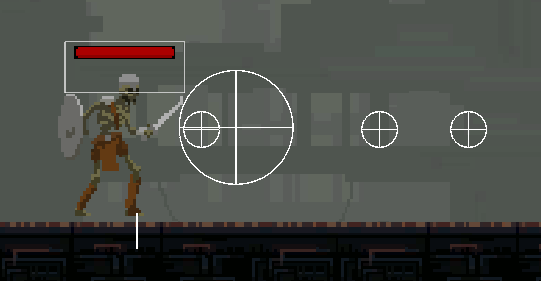

# 🕹️ Abyssal Descent

*Abyssal Descent* is a 2D story-based platformer game developed in Unity. The player progresses through layered levels, defeating enemies and overcoming obstacles to save a character named Ethan.
The game currently includes 2 playable layers and ends with a “to be continued” screen.

---

## 🎮 Gameplay Features

- Melee combat system
- Wall slide, wall jump, dash, ledge climb
- Inventory system and item-based healing (e.g. apples)
- Story progression between levels

---

## 👾 Enemy AI

Enemies are controlled using a Finite State Machine (FSM) approach with modular state logic such as patrol, attack, and stun behaviors.

---

## 🧱 Level Design

- 2 playable levels, each with distinct themes and visual assets
- Level layouts and object placements were designed using ready-made asset packs
- Design by **Nurgül Tunç**

---

## 🔉 Audio

- Background music selected and integrated by **Nurgül Tunç**
- Sourced from external royalty-free libraries

---

## 🖼️ Screenshots

### In-Game Overview

### Enemy Variety

### Level Design Example

### Hitbox & Melee Range Debug

### Player vs Ranged Enemy (Mage)

---

## 👥 Contributors

| Name          | Responsibilities                                 |
|---------------|--------------------------------------------------|
| **Kamil Sert**  | Player mechanics, combat system, enemy AI logic |
| **Nurgül Tunç** | Level design, inventory system, audio integration |

---

## ▶️ How to Run

1. Open the project in **Unity 6000.0.34f1**
2. Open the scene `MainMenu.unity` under `Assets/Scenes/`
3. Press Play

---

